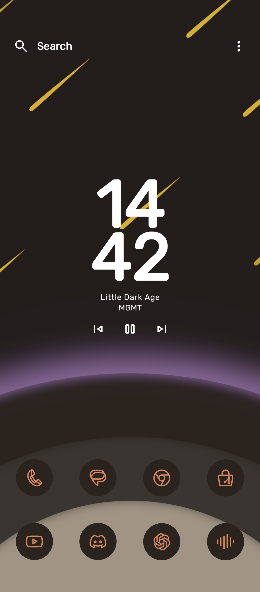
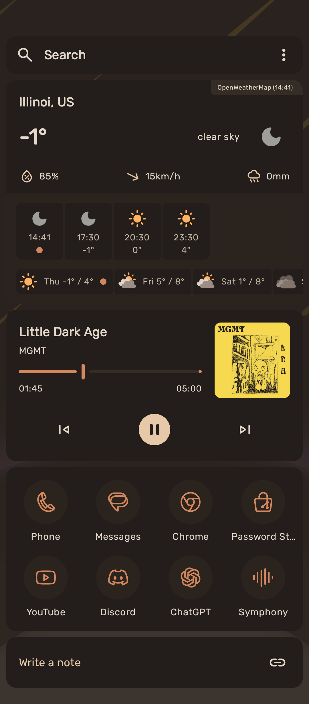
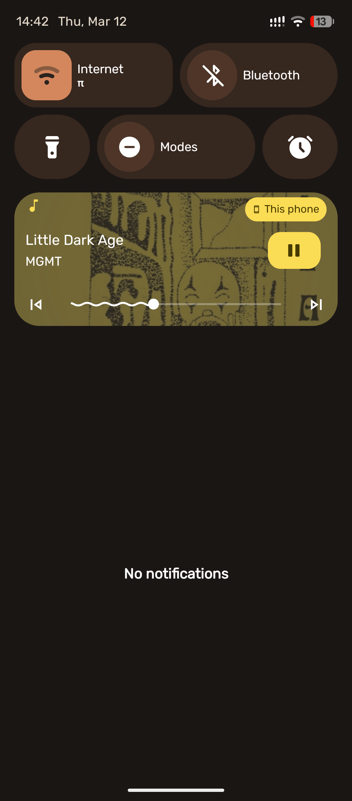
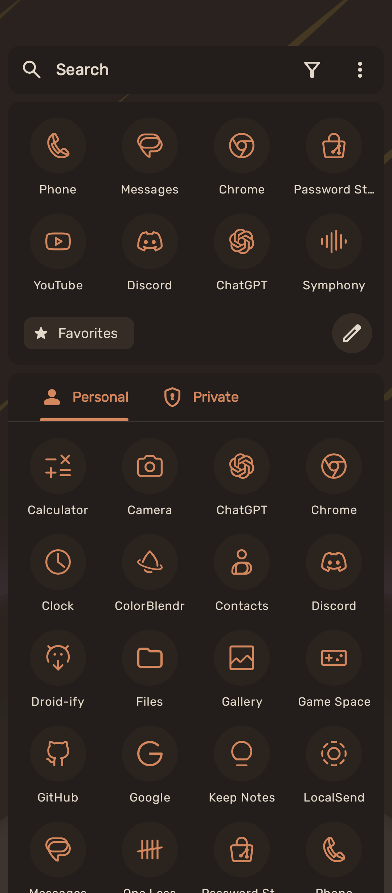

# AndroidDots

My Android rice configuration featuring a custom Kvaesitso launcher setup with ColorBlendr theming.

## Preview

  
  
  
  

## Components

- **Launcher**: [Kvaesitso](https://github.com/MM2-0/Kvaesitso)
- **Theme Engine**: [ColorBlendr](https://github.com/Mahmud0808/ColorBlendr)
- **Icons**: [Lawnicons](https://github.com/LawnchairLauncher/lawnicons)
- **Wallpaper**: [Space Stars](https://walls.sekiryl.is-a.dev)

## Installation

1. Install Kvaesitso launcher
2. Install and Setup ColorBlendr
3. Import the theme/configuration:
   - ColorBlendr: `ColorBlendr/Sekiratte.colorblendr`
   - Kvaesitso: `Kvaesitso/Sekiratte.kvtheme` or `Kvaesitso/Backup.kvaesitso`

## License

[GNU GPL 3.0](LICENSE)
